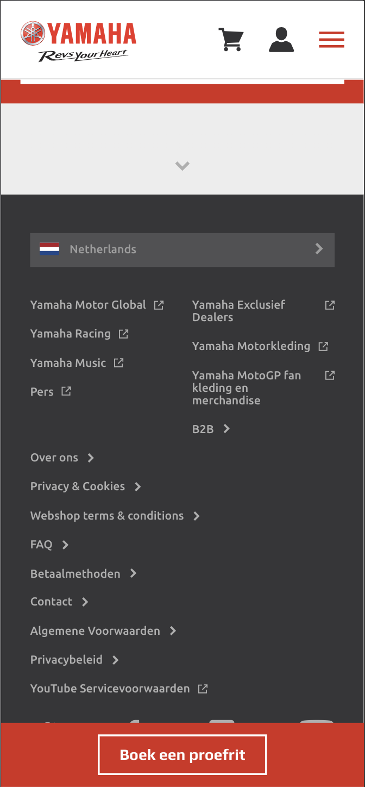

# Procesverslag
**Auteur:** Tim van der Ham (500827229).

Markdown cheat cheet: [Hulp bij het schrijven van Markdown](https://github.com/adam-p/markdown-here/wiki/Markdown-Cheatsheet). Nb. de standaardstructuur en de spartaanse opmaak zijn helemaal prima. Het gaat om de inhoud van je procesverslag. Besteedt de tijd voor pracht en praal aan je website.

## Bronnenlijst
1. Darken an image with filter: https://www.dailysmarty.com/posts/how-to-darken-an-image-with-css.
1. Pick a color of an image: https://pinetools.com/image-color-picker.
1. Hoe werkt een slider met images: https://codepen.io/shooft/pen/rNeEjYd?editors=1100.
1. Class van een element togglen: https://stackoverflow.com/questions/195951/how-can-i-change-an-elements-class-with-javascript.
1. Een font-awesome icon animeren: https://www.youtube.com/watch?v=XP-MRCUPZao.
1. Problem solving van de icoon animatie: https://stackoverflow.com/questions/29400527/my-css-animations-are-not-working-in-ios/29401112.
1. CSS keyframes animation: https://thoughtbot.com/blog/css-animation-for-beginners.
1. CSS fade in animation: https://blog.hubspot.com/website/css-fade-in.

## Eindgesprek (week 7/8)
Ik heb gekozen voor de surface plane.
Ik heb daarom 5 animaties geïmplementeerd:

1. Het kruisje van het hamburger menu.
1. Het uitklappen van het hamburger menu.
1. De hero image op de thuispagina.
1. Het pijltje in het dropdown menu op de detailpagina.
1. Het icoontje bij de eerste button op de detailpagina.

Ik had uiteindelijk redelijk wat moeite met het werkend krijgen van de dropdown en het hamburger menu op de detailpagina.
Hiervoor heb ik de hulp ingeschakeld van Daan, zodat hij me op weg kon helpen met deze menu's.
Na veel moeite heb ik het uiteindelijk werkend gekregen.

Daarnaast is het mij op de een of andere manier niet gelukt om de afbeeldingen in de horizontale scroll een normale hoogte te geven.
Ik heb hier een paar uur aan gezeten en zelfs met de hulp van anderen is het mij niet gelukt.

Verder vond ik dat de website die ik gekozen heb, heel veel fouten en rare features had. 
Deze heb ik een beetje aangepast of weggelaten, zodat het eindresultaat er minder raar uit ziet en beter werkt.

**Screenshot(s):**

**Homepage**

**Detailpagina**

## Voortgang 3 (week 6)

### Stand van zaken
Er is iets fout in mijn code, waardoor het allemaal heel gek weergegeven wordt.
Ik had een dropdown gemaakt en die werkte perfect. Nu kijk ik er een paar dagen later op terug en doet hij het niet meer.
In de tussentijd heb ik er niks aan veranderd.

**Stijn:** 
1. Kan ik met een  document.querySelector of iets in die richting ook css aan spreken en vervangen. Ik moet namelijk images loopen. Normaal doe je dit vanuit de html maar mijn achtergrond image staat in de css.

**Tim:**
1. Hoe maak ik een carousel met images van verschillende groottes?

**Screenshot(s):**

  
 
  

 ## Voortgang 2 (week 5)

### Stand van zaken
Het was makkelijk om alle code over te nemen, maar het kostte erg veel tijd.
Ik had soms problemen met het opslaan van de foto's, dus dat kostte ook erg veel tijd.

**Screenshot(s):**

### Agenda voor meeting
**Stijn:** 
1. Hoe kan ik het bovenste gedeelte van de home pagina goed maken? Dus het om de zo veel seconden verandere van de foto en tekst.
1. Hoe kan ik de header bovenop de main content zetten, nu word de img een beetje afgsneden, ik maak nu ook gebruik van een z-index om hem er op te leggen misschien dat dat het probleem verooraakt.
**Sara**
1. Hoe wordt mijn zoekbutton een vergrootglas?
**Tim**
1. Hoe krijg je de achtergrond van een tekst een stuk langer en hoe kan ik daar een foto overheen zetten?
1. Ik heb het idee dat de preview van brackets soms gek doet, doordat hij soms dingen niet aanpast of dingen vanuit zichzelf.
**Zain**
1. Gebruik ik teveel div's?

## Voortgang 1 (week 3)

### Stand van zaken
Het was makkelijk om alle code over te nemen, maar het kostte erg veel tijd.
Ik had soms problemen met het opslaan van de foto's, dus dat kostte ook erg veel tijd.

**Screenshot(s):**

 

### Agenda voor meeting

**Stijn:** 
1. Hoe maak je een oneindige loop van fotos horizontaal? 
1. Hoe zorg je ervoor dat fotos na 5 sec veranderen incl. tekst?

**Sara**
1. Wanneer gebruik ik te veel classes? 
1. Is het aantal wat ik heb te veel?

**Tim**
1. Hoe maak je een dropdown met transition die over andere tekst heen valt?
1. Hoe maak je een dropdown navigatie, die navigeert naar content op dezelfde pagina?
1. Hoe kan ik zien welke icon (i element) er word gebruikt?
1. Wanneer gaan we meer horen over het creëren van een hamburger menu?

**Zain**
1. Hoe voeg je items toe aan je header als die groter wordt?

**Julius**
1.

### Verslag van meeting

**Antwoorden op mijn vragen:**

## Breakdownschets (week 1)

## Intake (week 1)
**Je startniveau:** Rood.
**Je focus:** Surface layer.
**Je opdracht:** (https://www.yamaha-motor.eu/nl/nl/ "Yamaha motors")

**Screenshot(s) van de eerste pagina (small screen --> Iphone X):**

**Screenshot(s) van de tweede pagina (small screen --> Iphone X):**

